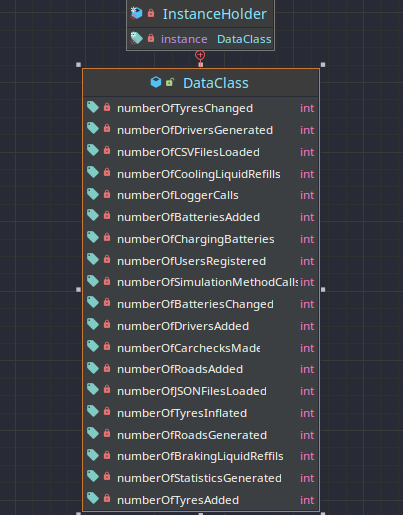
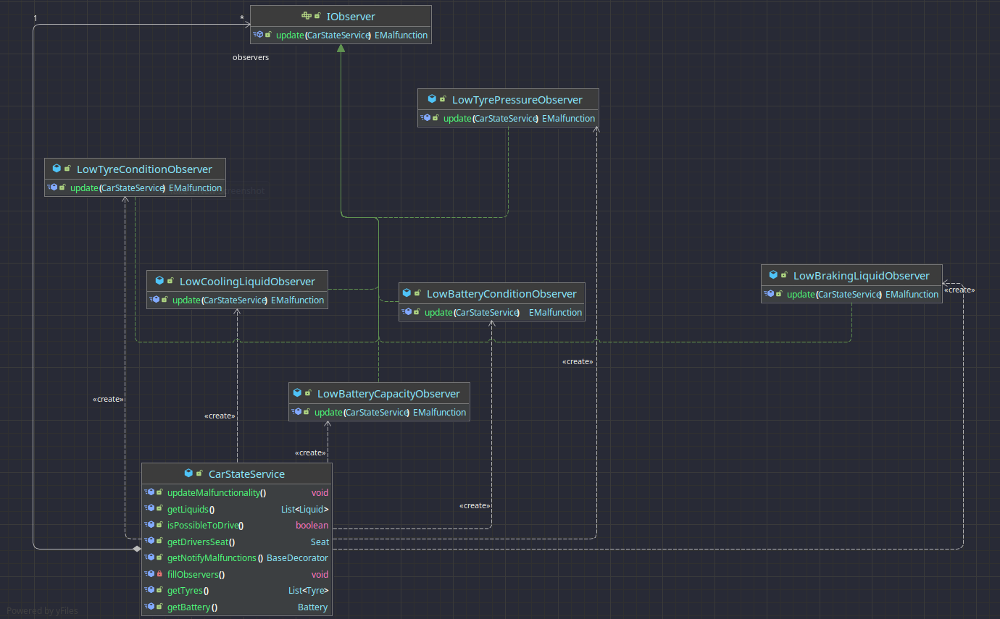
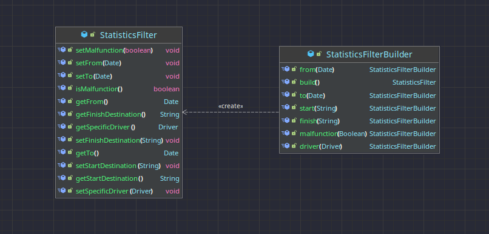
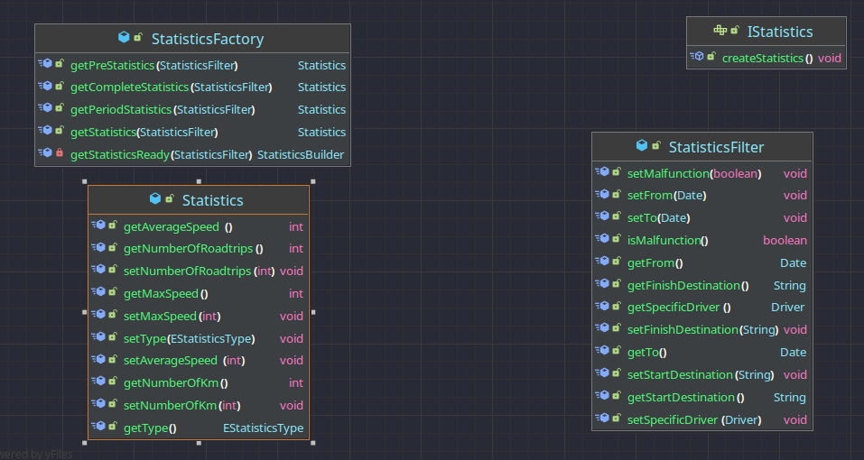
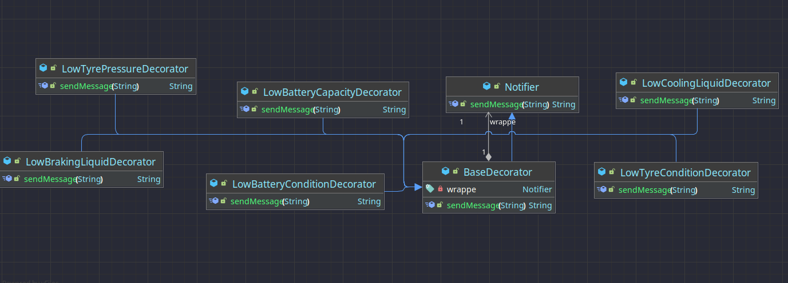
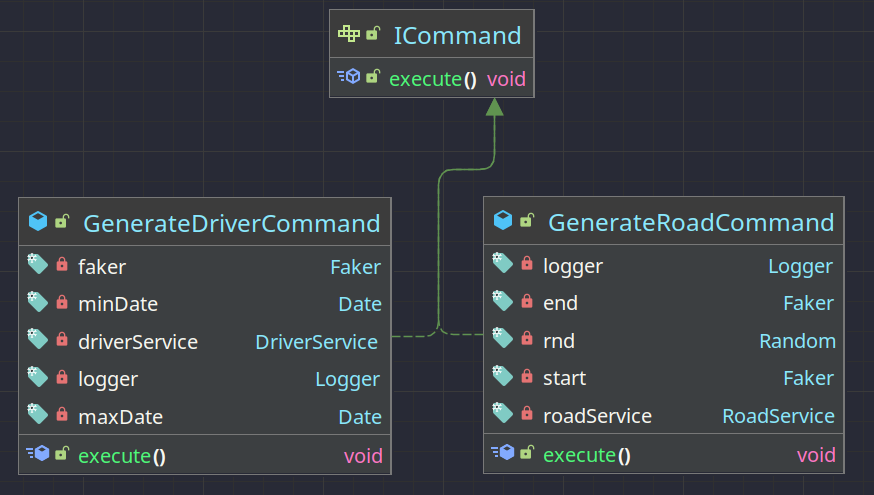
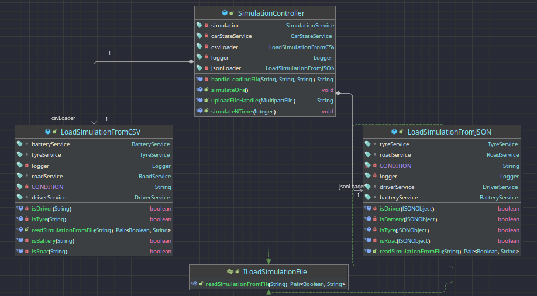
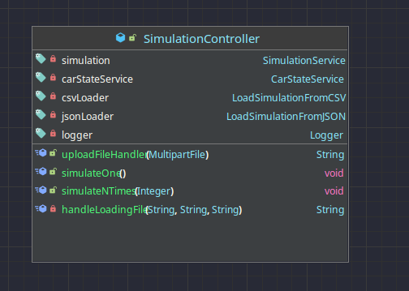
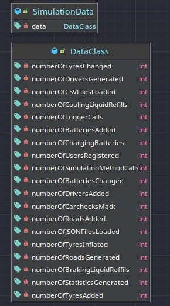

# Car status 🏎

###  [Click here for english version](#-english-version)
## 🇨🇿 Česká verze

V této semestrální práci se budeme zabývat tvorbou systému pro evidování
informací o automobilu. Níže uvádíme seznam funkcionalit:

Zobrazení informací o:

- Stavu nabití baterie v procentech a kWh a její aktuální stav
- Statistikách maximální rychlosti v jednotlivých jízdách
- Statistikách průměrné rychlosti v jednolivých jízdách 
- Statistikách jednotlivých jízd, které budou založeny na řidiči vozidla
- Jednotlivých provozních kapalinách
- Stavu jednotlivých pneumatik 
- Veškerých cestách (počáteční a koncový bod)

Upozornění na:
- Nízké hladiny provozních kapalin
- Chybová hlášení diagnostického systému
- Nízkou hladinu tlaku v pneumatikách

Manipulace:
- Změna poloh jednotlivých součástek komfortní jednotky
- Oprava pneumatik
- Zavolání asistenční služby při neobvyklém stavu vozidla

Určení systému
- Systém je určen pro řidiče nejen osobních automobilů, ikdyž ve své prvotní verzi je zaměřen na použití s tímto typem vozidel.
Řidiči bude umožňovat vzdálenou správu vozidla, získávání důležitých informací a v neposlední řadě ho bude upozorňovat na 
nestandartní stavy vozidla.

<h2 id="english-version">🌍 English version</h3>

In this semestral project we will deal with the creation of a system for recording
information about the car. Below is a list of pursued functionalities:

Displaying information about:

- Battery charge status in percentage and kWh and its current status
- Statistics of the maximum speed in each trip
- Statistics of the average speed in each trip
- Statistics of individual trips, which will be based on the driver of the vehicle
- Levels of individual operating fluids
- Condition of individual tyres
- All journeys (start and end points)

Alerts for:
- Low operating fluid levels
- Diagnostic system error messages
- Low tyre pressure

Handling:
- Changing the positions of the individual components of the comfort unit
- Tyre repair
- Calling for assistance in the event of an unusual vehicle condition

Who is the system designed for
- The system is designed for drivers of cars but not only passenger cars, although in its initial version it is intended for use with this type of vehicle.
  It will allow the driver to remotely manage the vehicle, retrieve important information and, last but not least, alert the driver to
  non-standard vehicle conditions.

<h2 id="omo">🌍 Návrhové vzory</h2>

### [Singleton](src/main/java/cz/cvut/fel/ear/carstatus/DataClass.java)
Singleton je u nás implementován ve třídě DataClass, jelikož tato třída bude v běhu potřeba pouze jednou. Je implementován s ochranou proti vláknům přes instance holder.

### [Observer](src/main/java/cz/cvut/fel/ear/carstatus/observers)
Observer u nás slouží k aktualizaci stavu vozidla, kdy po jízdě observery zkontrolují stav vozidla a aktualizují jeho provozuschopnost

### [Builder](src/main/java/cz/cvut/fel/ear/carstatus/builders)
Builder u nás slouží ke stavbě statistik a filtru statistik kdy nemusíme dostat veškerá data

### [Factory](src/main/java/cz/cvut/fel/ear/carstatus/statistics/StatisticsFactory.java)
Factory nám slouží k výrobě různých typů statistik, podle toho jaké parametry jsou zadané

### [Decorator](src/main/java/cz/cvut/fel/ear/carstatus/notifications)
Slouží k notifikaci uživatele na hlavní stránce v jakém stavu vozidlo aktuálně je

### [Chain of responsibility](src/main/java/cz/cvut/fel/ear/carstatus/notifications)
Slouží pro správné implementování filtrů, kdy si filtry předávají responsibilitu dál

### [Command](src/main/java/cz/cvut/fel/ear/carstatus/commands)
Slouží uživateli ke změně commandů, které může prováděť, buď generovat cestu či řidiče.

### [Template method](src/main/java/cz/cvut/fel/ear/carstatus/load_files)
Jako template method nám slouží metoda handleLoadingFile v simulačním kontroleru, kde načte souboru, což je společná část a poté jen předá vnitřek souboru správnému handleru.

### [Facade](src/main/java/cz/cvut/fel/ear/carstatus/rest/SimulationController.java)
Simulační kontroler nám slouží k jednoduchému ovládání aplikace přes připojení několika komponent v jednu jednoduše ovladatelnou

### [Private data class](src/main/java/cz/cvut/fel/ear/carstatus/DataClass.java)
Slouží nám k uložení veškerých informací o simulaci

